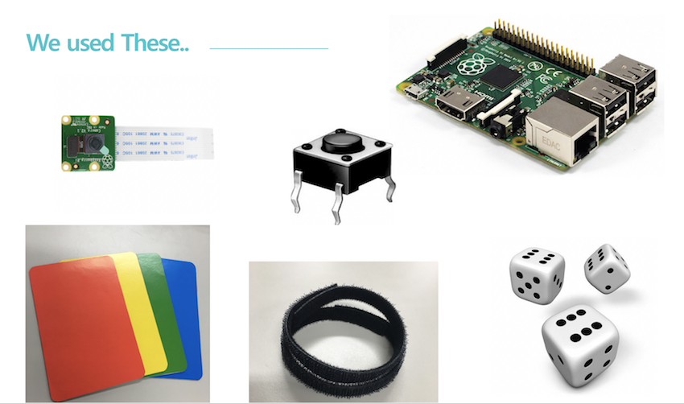

# Home-rehabilitation-treatmen(by Grape!)
We are participating in [EDISON2018](https://github.com/ys7yoo/Edison2018) project  
home rehabilitation treatment device using raspberry pi  

## Project description 
It is a rehabilitation device for people with paralyzed hands.  
We provide some games(using video recognition and tact) and patients __can rehabilitate through games__

## Team Grape!
+ Our team name is Grape!
+ We're studying Electronic Engineering, Incheon National University.
+ Team members
  - __Park jun young__: 3rd grade (9851248@gmail.com)
  - __Lee jong gill__: 2nd grade (parisinus04@hotmail.com)
  - __Shin na ra__: 1st grade (naracon03@naver.com)
***


# Project plan
Project period: _2018. 07. 03. \~ 2018. 07. 12._  
We found problem, found problem solution, and developed some games.  
We had meetings every day during lunch(12:00\~13:00) and dinner(18:00\~19:00)  
## Problems
1. Increase in stroke patients.
2. Shortage of rehabilitation hospitals.
3. Takes a lot of money and time.
4. Without rehabilitation, paralysis gets worse.

## Solutions
1. Provide patients with rehabilitation treatment.
2. Have fun with games.
3. Provide low cost services.

## Contents
### 1. __dice game__ [demo(video)](https://youtu.be/E8Xhtr497l8)
  + We used picamera and opencv(module in python) to recognize the dice.
  + This game is rolling dice game.
  + If you win the game, you can read good words.

### 2. __hand gesture game__ [demo(video)](https://youtu.be/IvRqTmsWWxw)
  + We used picamera and opencv(module in python) to recognize the hand.
  + This game is counting iteration. (finger concentration or stretching)
 
### 3. __pick up color card game__ [demo(video)](https://youtu.be/Pj2LsNEUcCA)
  + We used picamera and opencv(module in python) to recognize the color card.
  + This game is played by picking up color cards that computer shows. 

### 4. __mole game__ [demo(video)](https://youtu.be/GB_V4lXnMM8)
  + We used tact switch and pygame(module in python)
  + This game is catching mole randomly coming out on the computer screen.

### 5. __maze game__ [demo(video)](https://youtu.be/EF00FUXciWk)
  + We used tact switch and pygame(module in python)
  + This game is solving complicated maze.
***


# We used these..

1. raspberry pi3
2. pi camera
3. TACT switch
4. python3
5. opencv
5. RPi.GPIO
6. numpy
7. pygame
8. turtle

## Installation of dependencies
1. __install RASPBIAN__   
  We used [RASPBIAN](https://www.raspberrypi.org/downloads/raspbian/) : Release date: 2018.06.27


2. __apt-get update__  
  ```bash
  pi@raspberrypi:~ $ sudo apt-get update
  pi@raspberrypi:~ $ sudo apt-get upgrade
  ```


3. __Install RPi.GPIO__  
  ```bash
  pi@raspberrypi:~ $ sudo apt-get install python-dev python3-dev
  pi@raspberrypi:~ $ sudo apt-get install python-rpi.gpio
  ```


4. __Install numpy__  
  ```bash
  pi@raspberrypi:~ $ sudo apt-get install python3-numpy
  ```


5. __Install opencv__  
  We used [github](https://github.com/dltpdn/opencv-for-rpi.git) to install opencv
  ```bash
  pi@raspberrypi:~ $ git clone https://github.com/dltpdn/opencv-for-rpi.git
  pi@raspberrypi:~ $ cd {your path}/opencv-for-rpi/stretch/3.4.0
  pi@raspberrypi:~/...../3.4.0 $ sudo apt-get install ./OpenCV*.deb -y
  ```
  
  &nbsp;&nbsp;&nbsp;&nbsp;Install check
  ```bash
  pi@raspberrypi:~ $ pkg-config --modversion opencv
  ```
  &nbsp;&nbsp;&nbsp;&nbsp;&nbsp;&nbsp;&nbsp;&nbsp;if you look at 3.4.0, it is success!


6. __Setting picamera__  
  pi camera is not USB type, so you should set it to recgnize it as a device.
  ```bash
  pi@raspberrypi:~ $ sudo modprobe bcm2835-v4l2
  ```

  &nbsp;&nbsp;&nbsp;&nbsp;&nbsp;&nbsp;&nbsp;&nbsp;Checking device
  ```bash
  pi@raspberrypi:~ $ ls /dev/video*
  ```


7. __etc__  
  python3, pygame are installed with the RASPBIAN installation.
  turtle is internal function of python3
  _if there is anything else you need Please install_
***


## Future development plan
1. We can get data from patients how much time they took to finish up the each game.  

2. Scrutinizing that data we collected, We could discern degree of stroke or other diseases related to 
hand paralysis or numbness. 

3. Now, In this stage, IoT technology will transfer not only our raw data but also analysis of data to the
medical society.  

4. And then we can make ecosystem between patients society and medical society that they can feedback
more precisely and promptly.
